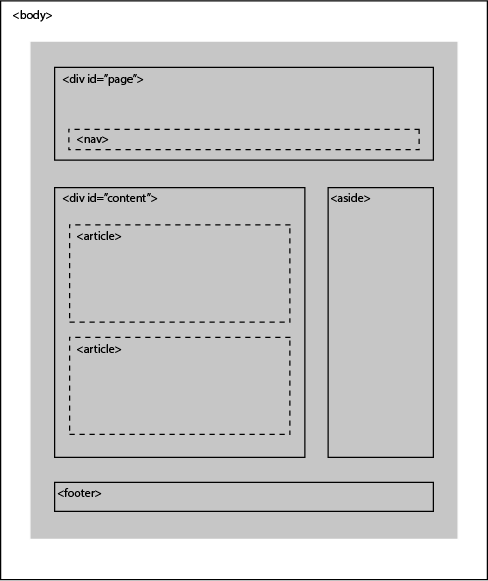

[Home](README.md)

## HTML Knowledge Review

1. Using _____ at the head of your code tells the browser which version of HTML you are using.  

1. How do you make comments in your code while using HTML, Javascript, and CSS?  

1. What is the difference between id and class attributes?  

1. Refresh on these tags:  

\
  
\  
\<iframes>  
\<meta>  

Recall the steps of the website design process:  
Think about the user foremost. Who are they, what are their goals and how will they get there.

## Revisit these notes for further review:  
- [Starting with HTML](html.md)

- [Starting with CSS](css.md)

- [Starting with JavaScript](javascript.md)

[Home](README.md)
